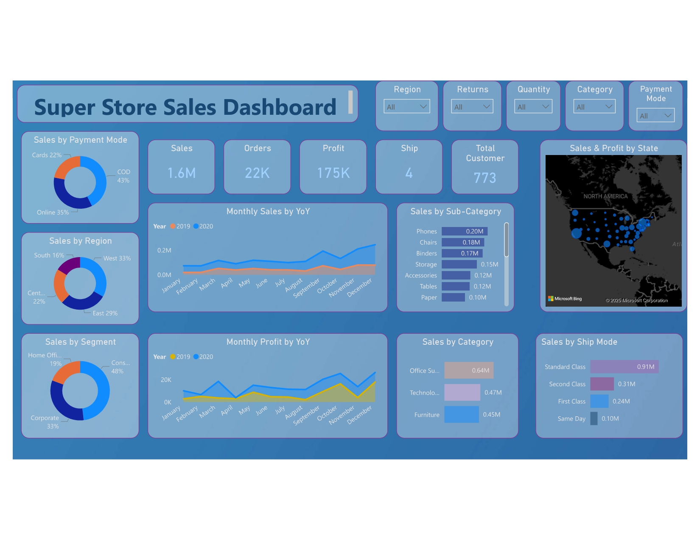

# SuperStore Sales Analysis

This repository contains an in-depth analysis of the **SuperStore Sales Dataset**.  
The goal is to uncover insights into sales performance, customer behavior, and product profitability to provide **actionable recommendations** for the business.

---

## 📑 Table of Contents
- [Problem Statement](#problem-statement)
- [Dataset Description](#dataset-description)
- [Data Cleaning](#data-cleaning)
- [Data Analysis](#data-analysis)
- [Key Insights](#key-insights)
- [KPIs and Metrics](#kpis-and-metrics)

---

## 🚩 Problem Statement

The primary objective of this analysis is to **identify key drivers of sales and profit** for the SuperStore.  

We aim to answer critical business questions such as:
- What are the overall sales trends over time?
- Which product categories and sub-categories are the most and least profitable?
- Who are the most valuable customers and in which regions are they located?
- How does ship mode affect sales and customer satisfaction?
- What areas can the business optimize to increase profitability?

---

## 📂 Dataset Description

The dataset used for this analysis is **`SuperStore_Sales_Dataset.csv`**.  
After cleaning and feature engineering, the final dataset includes the following columns:

- **Row ID**: Unique identifier for each row.  
- **Order ID**: Identifier for each order.  
- **Order Date**: Date the order was placed.  
- **Ship Date**: Date the order was shipped.  
- **Ship Mode**: Shipping method used.  
- **Customer ID**: Unique identifier for each customer.  
- **Customer Name**: Name of the customer.  
- **Segment**: Customer market segment (e.g., Consumer, Corporate).  
- **Country**: Country where the order was placed.  
- **City**: City of the order.  
- **State**: State of the order.  
- **Region**: Geographical region.  
- **Product ID**: Unique identifier for each product.  
- **Category**: Main category of the product.  
- **Sub-Category**: Sub-category of the product.  
- **Product Name**: Name of the product.  
- **Sales**: Total sales amount for the order line.  
- **Quantity**: Number of units ordered.  
- **Profit**: Profit generated from the order line.  
- **Returns**: Indicates if the product was returned.  
- **Payment Mode**: Payment method used.  
- **Avg Days**: Days between order date and ship date.  

---

## 🧹 Data Cleaning

Data was imported and transformed using **Power Query** in **Power BI**.

**Steps to Import Data:**
1. Navigate to **Get data → More → All → Folder → Connect**  
2. Provide the dataset folder path → Click **OK**  
3. Open **Power Query editor** with *Transform Data*  

**Calculated Column for Shipping Duration (DAX):**
```arduino
Avg Days = DATEDIFF('SuperStore_Sales'[Order Date], 'SuperStore_Sales'[Ship Date], DAY)
```


## 📊 Data Analysis

The cleaned dataset was used to build an **interactive Power BI dashboard** to visualize sales performance and forecast future trends.

### 📈 Dashboards Included
- **Sales Performance Dashboard** → Comprehensive overview of KPIs, sales by region, segment, category, and customer preferences.  
- **Sales Forecast Dashboard** → Visualizes historical sales trends and projects future sales.  

---

## 🔑 Key Insights

### 🌍 Geographical & Customer Insights
- **Regional Dominance**: West (**33%**) and East (**29%**) regions are the primary markets.  
- **Top States**: California and New York are the highest revenue-generating states.  
- **Dominant Customer Segment**: Consumer segment contributes **48% of sales**.  

### 📦 Product & Sales Insights
- **Revenue Drivers**:  
  - *Category*: Office Supplies = largest by sales volume.  
  - *Sub-Categories*: Phones, Chairs, and Binders are top contributors.  
- **Growth & Seasonality**:  
  - Visible **YoY growth trend** in sales and profit (2019 → 2020).  
  - **Seasonal peak** in Q4 (Oct–Dec) every year.  

### ⚙️ Operational Insights
- **Ship Mode**: Standard Class = most utilized method.  
- **Payment Preference**: Cash on Delivery (COD) used in **43%** of transactions.  

---

## 📌 KPIs and Metrics
- **Total Sales**: 💰 $1.6M  
- **Total Profit**: 📈 $175K  
- **Total Orders**: 📦 22K  
- **Average Shipping Days**: 🚚 4 days  


